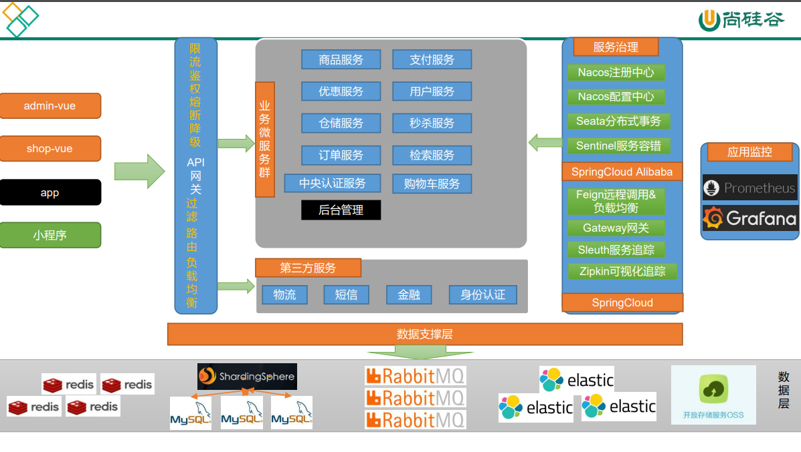

### 谷粒商城简介

#### 项目介绍

gulimall（谷粒商城） 项目是一套电商项目，包括前台商城系统以及后台管理系统，基于 SpringCloud + SpringCloudAlibaba + MyBatis-Plus实现，采用 Docker 容器化部署。前台商城系统包括：用户登录、注册、商品搜索、商品详情、购物车、下订单流程、秒杀活动等模块。后台管理系统包括：系统管理、商品系统、优惠营销、库存系统、订单系统、用户系统、内容管理等七大模块。

####  项目演示

##### **前台台部分功能演示效果**

> 下订单


> 秒杀


##### **后台部分功能演示效果**

后台登录上传商品


> nacos服务


链路追踪ZipKin可视化界面


#### 软件架构

##### **系统架构图**


##### **业务架构图**




#### 组织结构

```
gulimall
├── gulimall-common -- 工具类及通用代码
├── renren-generator -- 人人开源项目的代码生成器
├── gulimall-auth-server -- 认证中心（社交登录、OAuth2.0、单点登录）
├── gulimall-cart -- 购物车服务
├── gulimall-coupon -- 优惠卷服务
├── gulimall-gateway -- 统一配置网关
├── gulimall-order -- 订单服务
├── gulimall-product -- 商品服务
├── gulimall-search -- 检索服务
├── gulimall-seckill -- 秒杀服务
├── gulimall-third-party -- 第三方服务
├── gulimall-ware -- 仓储服务
└── gulimall-member -- 会员服务
```


#####  开发工具

|     工具      |        说明         |                      官网                       |
| :-----------: | :-----------------: | :---------------------------------------------: |
|     IDEA      |    开发Java程序     |     https://www.jetbrains.com/idea/download     |
| RedisDesktop  | redis客户端连接工具 |        https://redisdesktop.com/download        |
|  SwitchHosts  |    本地host管理     |       https://oldj.github.io/SwitchHosts        |
|    X-shell    |  Linux远程连接工具  | http://www.netsarang.com/download/software.html |
|    Navicat    |   数据库连接工具    |       http://www.formysql.com/xiazai.html       |
| PowerDesigner |   数据库设计工具    |             http://powerdesigner.de             |
|    Apifox     |   API接口调试工具   |              https://www.apifox.cn              |
|    Jmeter     |    性能压测工具     |            https://jmeter.apache.org            |
|    Typora     |   Markdown编辑器    |                https://typora.io                |

#####  开发环境

|     工具      | 版本号  |                             下载                             |
| :-----------: | :-----: | :----------------------------------------------------------: |
|      JDK      |   1.8   | https://www.oracle.com/java/technologies/javase/javase-jdk8-downloads.html |
|     Mysql     | 8.0.26  |                    https://www.mysql.com                     |
|     Redis     |  Redis  |                  https://redis.io/download                   |
| Elasticsearch |  7.6.2  |               https://www.elastic.co/downloads               |
|    Kibana     |  7.6.2  |               https://www.elastic.co/cn/kibana               |
|   RabbitMQ    |  3.8.5  |            http://www.rabbitmq.com/download.html             |
|     Nginx     |  1.1.6  |              http://nginx.org/en/download.html               |
|    Node.js    | 10.16.3 |                      https://nodejs.org                      |

注意：以上的除了jdk、Node.js，我的MySQL使用的是Windows，其它都是采用docker方式的进行安装，详细安装步骤可参考百度!!!

##### 搭建步骤

> Windows环境部署

- 修改本机的host文件，映射域名端口

```
# gulimall
192.168.56.10 gulimall.com
192.168.56.10 search.gulimall.com
192.168.56.10 item.gulimall.com
192.168.56.10 auth.gulimall.com
192.168.56.10 cart.gulimall.com
192.168.56.10 order.gulimall.com
192.168.56.10 ware.gulimall.com
192.168.56.10 member.gulimall.com
192.168.56.10 seckill.gulimall.com

# 单点登录测试
127.0.0.1 client1.com
127.0.0.1 client2.com
127.0.0.1 sso.com
```

- 修改Linux中Nginx的配置文件

/mydata/nginx/conf/nginx.conf

```
user  root;
worker_processes  1;

error_log  /var/log/nginx/error.log warn;
pid        /var/run/nginx.pid;


events {
    worker_connections  1024;
}


http {
    include       /etc/nginx/mime.types;
    default_type  application/octet-stream;

    log_format  main  '$remote_addr - $remote_user [$time_local] "$request" '
                      '$status $body_bytes_sent "$http_referer" '
                      '"$http_user_agent" "$http_x_forwarded_for"';

    access_log  /var/log/nginx/access.log  main;

    sendfile        on;
    #tcp_nopush     on;

    keepalive_timeout  65;

    #gzip  on;

	#配置这里
    include /etc/nginx/conf.d/*.conf;
   	 upstream gulimall{
	      server 192.168.56.1:88; #gateway, not only one, IP地址为virtualbox虚拟机网络网关
	 }
    

}

```

/mydata/nginx/conf/conf.d/gulimall.conf

```
server {
	listen       80;
	server_name gulimall.com *.gulimall.com;

	#踩坑，linux文件挂载到容器中的目录是/usr/share/nginx/html，不要填写linux的目录，否则静态资源无法找到
	location /static/ {
		root /usr/share/nginx/html;
	}

	location / {
		#proxy_pass http://127.0.0.1:10000;
		proxy_set_header Host $host; #nginx代理给网关的时候会丢失host，需要设置host
		proxy_pass http://gulimall;
	}
}
```

#### 技术选型

##### 后端技术

|        技术        |           说明           |                      官网                       |
| :----------------: | :----------------------: | :---------------------------------------------: |
|     SpringBoot     |       容器+MVC框架       |     https://spring.io/projects/spring-boot      |
|    SpringCloud     |        微服务架构        |     https://spring.io/projects/spring-cloud     |
| SpringCloudAlibaba |        一系列组件        | https://spring.io/projects/spring-cloud-alibaba |
|    MyBatis-Plus    |         ORM框架          |             https://mp.baomidou.com             |
|  renren-generator  | 人人开源项目的代码生成器 |   https://gitee.com/renrenio/renren-generator   |
|   Elasticsearch    |         搜索引擎         |    https://github.com/elastic/elasticsearch     |
|      RabbitMQ      |         消息队列         |            https://www.rabbitmq.com             |
|   Springsession    |        分布式缓存        |    https://projects.spring.io/spring-session    |
|      Redisson      |         分布式锁         |      https://github.com/redisson/redisson       |
|       Docker       |       应用容器引擎       |             https://www.docker.com              |
|        OSS         |        对象云存储        |  https://github.com/aliyun/aliyun-oss-java-sdk  |

##### 前端技术

|   技术    |    说明    |           官网            |
| :-------: | :--------: | :-----------------------: |
|    Vue    |  前端框架  |     https://vuejs.org     |
|  Element  | 前端UI框架 | https://element.eleme.io  |
| thymeleaf |  模板引擎  | https://www.thymeleaf.org |
|  node.js  | 服务端的js |   https://nodejs.org/en   |


#### 使用说明


1.  xxxx
2.  xxxx
3.  xxxx

#### 参与贡献

1.  Fork 本仓库
2.  新建 Feat_xxx 分支
3.  提交代码
4.  新建 Pull Request


#### 特技

1.  使用 Readme\_XXX.md 来支持不同的语言，例如 Readme\_en.md, Readme\_zh.md
2.  Gitee 官方博客 [blog.gitee.com](https://blog.gitee.com)
3.  你可以 [https://gitee.com/explore](https://gitee.com/explore) 这个地址来了解 Gitee 上的优秀开源项目
4.  [GVP](https://gitee.com/gvp) 全称是 Gitee 最有价值开源项目，是综合评定出的优秀开源项目
5.  Gitee 官方提供的使用手册 [https://gitee.com/help](https://gitee.com/help)
6.  Gitee 封面人物是一档用来展示 Gitee 会员风采的栏目 [https://gitee.com/gitee-stars/](https://gitee.com/gitee-stars/)
